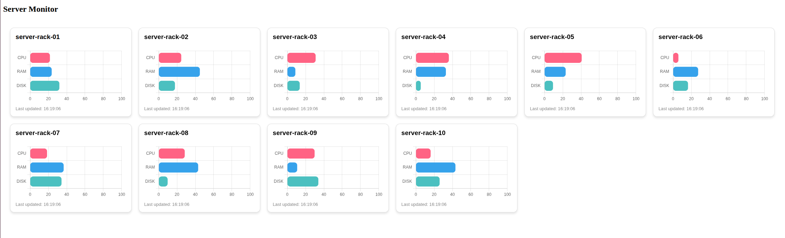

A multi module gradle, spring boot, kafka streams project.

The project domain focuses on machine metrics, CPU, RAM and DISK.

Bring it all up with:
`./startup.sh`

**common**\
Contains messages shared among other modules.

**producer-service**\
Provides a REST API to which you can send machine metric events, either individually or invoking
the generator which will generate multiples based on request parameters.

**consumer-service-a**\
This is where the kafka stream topology lives and is responsible for slicing the metric events
and feeding into other topics which are read by listeners and fed into other sinks e.g. web sockets

**consumer-service-b**\
Does nothing at present

**dashboard-service**\
Provides a visual UI which renders charts/graphs ingesting web socket records supplied by the
consumer service



Useful URLs:
* kafka-ui - http://localhost:9090/
* server monitor - http://localhost:9331/live-machine-metrics

IntelliJ http client requests [here](kafka-streams.http)

Sample curl requests
```shell
## send a single metric
curl -X POST --location "http://localhost:9330/api/metric/add" \
    -H "Accept: application/json" \
    -H "Content-Type: application/json" \
    -d '{
          "machineId": "server-rack-02",
          "metricType": "CPU_USAGE",
          "value": 42,
          "timestamp": 1773066416
        }'
        
## generate a bunch of metrics
curl -X POST --location "http://localhost:9330/api/generator/run?machines=4&iterations=100"
```